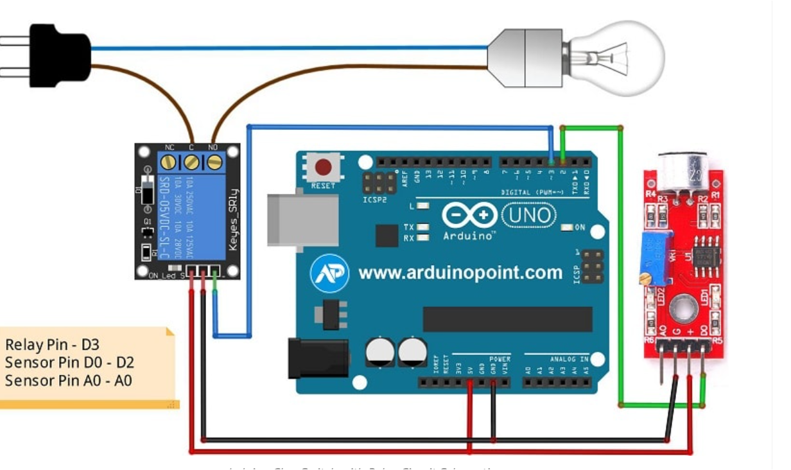

# Clap Light Switch 🔊💡

This Arduino-based project allows you to control an AC bulb using a clap sound. It uses a sound sensor to detect claps and a relay module to safely switch high-voltage devices like a bulb. This is a great example of sound-based automation using embedded systems.

---

## 🛠 Components Used

| No. | Component                            | Quantity | Description                                           |
|-----|--------------------------------------|----------|-------------------------------------------------------|
| 1   | Arduino Uno                          | 1        | Microcontroller board to process the input and control output |
| 2   | Sound Sensor Module (KY-038 / LM393) | 1        | Detects sound like a clap and sends a digital signal to Arduino |
| 3   | Relay Module (5V)                    | 1        | Switches the AC bulb using Arduino control            |
| 4   | AC Bulb + Holder                     | 1        | Light bulb to be turned on/off using the relay        |
| 5   | LED (optional)                       | 1        | Can be used for testing instead of the AC bulb        |
| 6   | 220Ω Resistor                        | 1        | For current-limiting with LED                         |
| 7   | Jumper Wires                         | Several  | For connections                                       |
| 8   | Breadboard                           | 1        | For circuit prototyping                               |
| 9   | USB Cable                            | 1        | To upload code to Arduino                             |

---

## ⚡ How It Works

1. When you clap, the sound sensor detects a sudden change in sound level.
2. It sends a **HIGH signal** to the Arduino.
3. The Arduino reads this signal and toggles the state of the **relay**.
4. The relay switches ON/OFF the connected **AC bulb**.
5. If using an LED instead of a bulb, the LED will toggle on each clap.

---

## 🔁 Future Improvements

- Implement **double-clap** detection for more reliable switching
- Add **a timer** so the light turns off automatically after a few minutes
- Use **optocoupler** for better isolation and safety
- Add a **mobile app** for remote override via Bluetooth or Wi-Fi

---

## 📷 Circuit Diagram

> Add your image here, e.g.,

---

## 🔐 Safety Note

> If you're using a relay to control an AC appliance, **always take precautions**:
> - Ensure the relay is **rated for 220V AC**
> - Avoid touching live wires
> - Never connect AC load while your Arduino is powered over USB

---

## 🎯 Author

**Hammad Younas**  
GitHub: [@Hammad-Younas-info](https://github.com/Hammad-Younas-info)  
Email: hammad.younas.info@gmail.com
